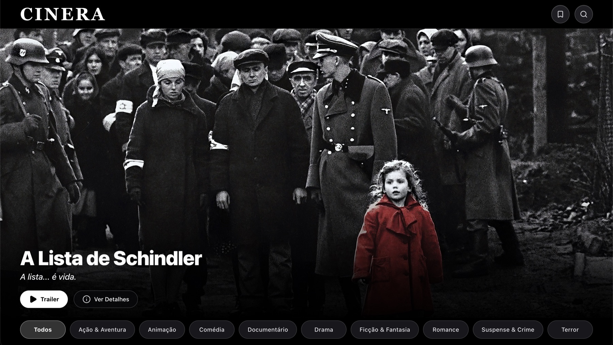
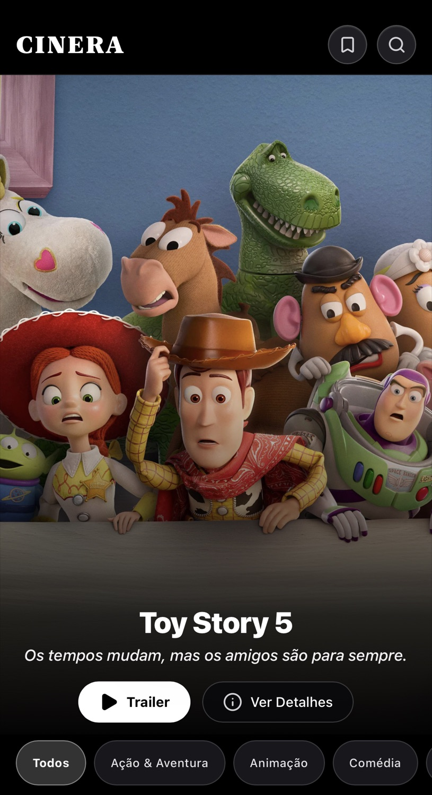
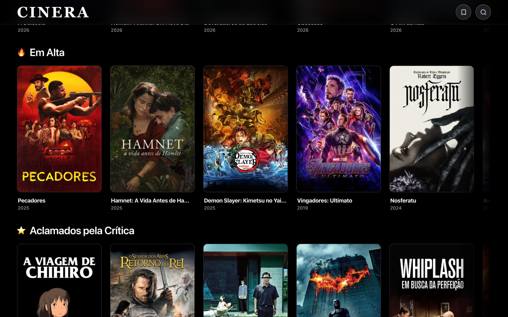
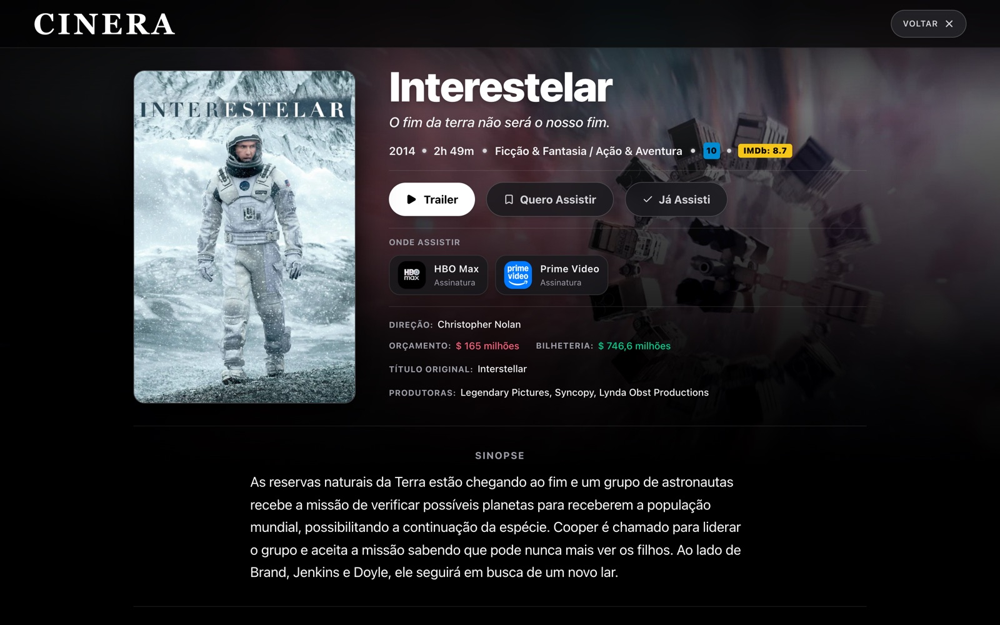
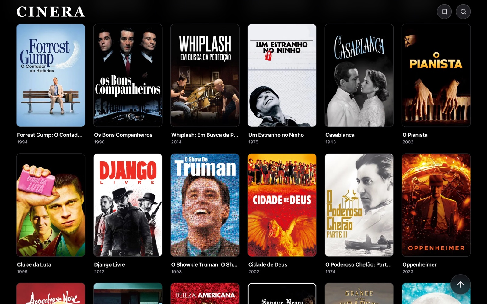
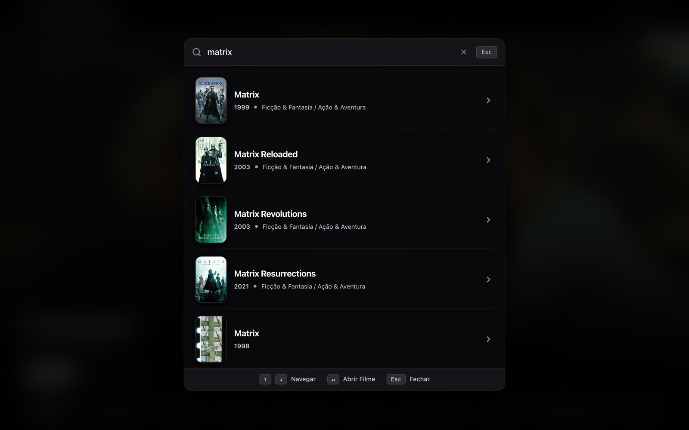
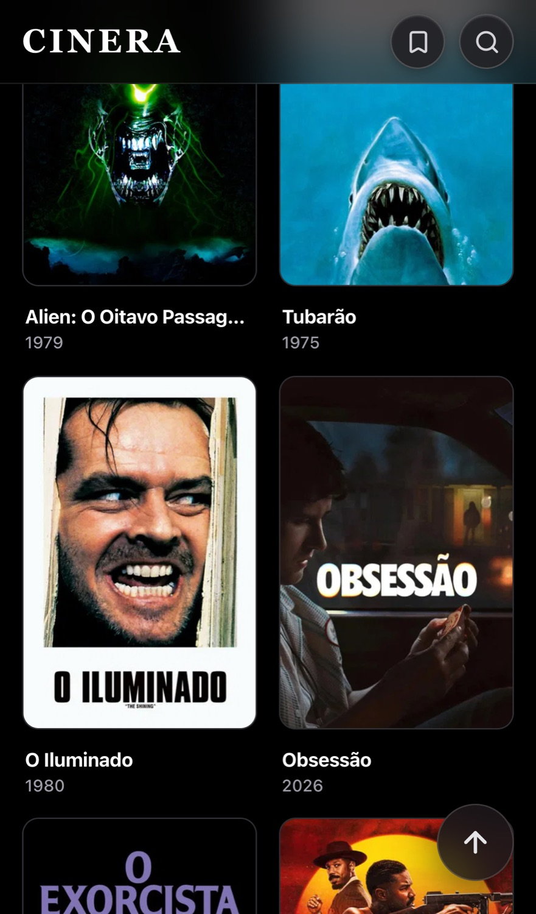
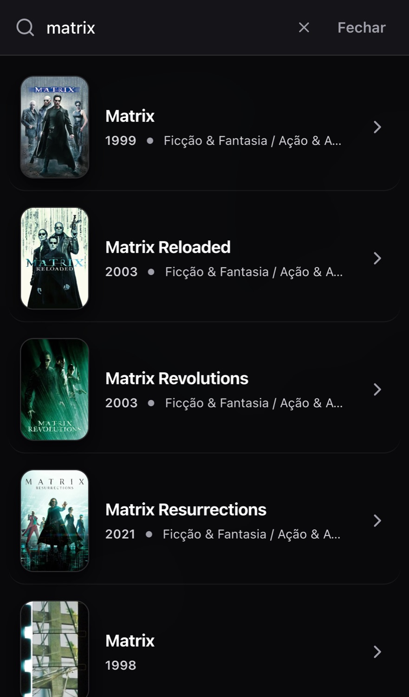
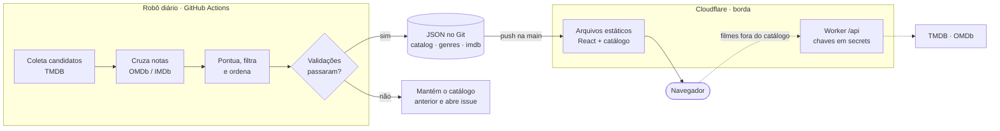
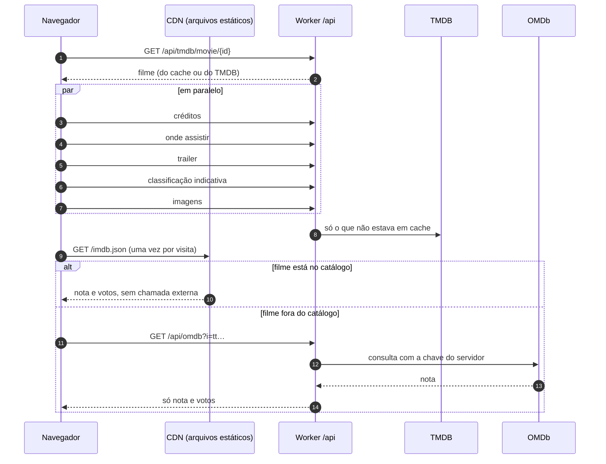

<div align="center">

# CINERA

**Um catálogo de filmes curado por algoritmo, montado todo dia por um robô e servido da borda, sem servidor.**

[](https://cinera.party)

[](https://github.com/chrystianomoura/cinera/actions/workflows/ci.yml)
[](https://github.com/chrystianomoura/cinera/actions/workflows/atualizar-catalogo.yml)


[](LICENSE)

<br />

&nbsp;&nbsp;

</div>

<br />

## O que é

O CINERA organiza filmes em **9 categorias** e **5 fileiras** (Em Alta, Novidades, Aclamados, Clássicos e Populares), com um destaque em tela cheia, ficha completa de cada filme e a lista de onde assistir **no Brasil**.

A graça não está só na tela, está no que acontece por trás dela: **ninguém escolhe os filmes na mão**. Um robô cruza notas de públicos e fontes diferentes, descarta nota inflada, espalha as franquias, gira a ordem de um jeito determinístico e publica o resultado todo dia, **só se passar numa bateria de validações**. O site em si é feito só de arquivos estáticos na borda do Cloudflare, e um Worker minúsculo guarda as chaves de API.

> Mais de 2.500 filmes distintos, até 400 por categoria, atualizados todos os dias, sem banco de dados e sem servidor para manter.

## Em destaque

- **Curadoria algorítmica explicável.** Cada posição da lista tem uma razão, e os critérios estão no código ([`scripts/curation/`](scripts/curation)), cobertos por testes.
- **Zero servidor, zero banco.** O catálogo é JSON versionado no Git. O histórico do que mudou a cada dia é o próprio `git log`.
- **Segurança sem chave no navegador.** O site nunca fala com o TMDB nem com o OMDb: passa por um Worker com rotas fixas, cache e limite de requisições.
- **Qualidade medida, não prometida.** Tipos, lint, 147 testes unitários, 42 execuções ponta a ponta (desktop e mobile), acessibilidade com axe e validação do catálogo publicado, tudo no CI.
- **Classificação única.** Ficha, pesquisa e listas usam a mesma função para decidir a categoria de um filme, então o mesmo filme nunca aparece em categorias diferentes dependendo da tela.

## Tour

<div align="center">

**Fileiras da Home** · rolagem horizontal, uma curadoria por fileira



<br /><br />

| **Ficha do filme** · onde assistir, notas e ações | **Categoria** · grade com rolagem infinita |
|:---:|:---:|
|  |  |

**Pesquisa** · teclado primeiro, com as categorias do CINERA em cada resultado



<br /><br />

**No celular**

| Ficha | Categoria | Pesquisa |
|:---:|:---:|:---:|
|  |  |  |

</div>

## O projeto em números

| | |
|---|---|
| **Catálogo** | 2.526 filmes distintos · 9 categorias de até 400 filmes · 5 fileiras · 5 destaques |
| **Peso do site** | 141 KB de JavaScript e 10 KB de CSS (gzip) · catálogo da Home em 62 KB (gzip) |
| **Código** | ~12 mil linhas de TypeScript (app, Worker, scripts e testes) · 167 commits |
| **Testes** | 147 unitários · 42 execuções ponta a ponta (21 cenários × desktop e mobile) · validação do catálogo publicado |
| **Lighthouse** | Acessibilidade **100** · Boas práticas **100** · SEO **100** · Desempenho ~90 (desktop) e ~83 (mobile) |
| **Automação** | 4 rodadas do robô por dia · CI em cada push · Dependabot semanal |

## Funcionalidades

| | |
|---|---|
| **Home** | Destaque em tela cheia (5 filmes, 7 s cada, com efeito Ken Burns), filtros por categoria e fileiras com rolagem horizontal |
| **Categorias** | Listas de até 400 filmes com rolagem infinita; o fim da lista sempre fecha uma linha cheia, em qualquer largura de tela |
| **Ficha do filme** | Sinopse, elenco, galeria, trailer, classificação indicativa, notas e **onde assistir no Brasil** (assinatura ou, quando não há, aluguel) |
| **Pesquisa** | Tolerante a acento e a variações de título, entende coleções e franquias, e sempre devolve só as categorias do CINERA |
| **Minha biblioteca** | "Quero assistir" e "Já assisti", guardados no próprio navegador, sem cadastro |
| **Acessibilidade** | Navegação por teclado, foco gerenciado nos modais, rótulos ARIA e auditoria automática com axe |

## Como funciona



**O caminho comum nunca toca em API externa.** Home, categorias e a nota do IMDb dos filmes do catálogo saem de arquivos estáticos servidos pela CDN. O Worker só entra para o que não está no catálogo (por exemplo, a ficha de um filme encontrado na pesquisa), com cache de 1 hora para o TMDB e de 24 horas para o OMDb.

### O que acontece ao abrir uma ficha



### Um dia na vida do catálogo

| Hora (Brasília) | O que acontece |
|---|---|
| **00h30** | O robô monta o catálogo do dia: coleta, pontua, ordena, gira a ordem e valida. Se tudo passar, faz o commit na `main` e o Cloudflare publica em poucos minutos |
| **06h30 · 12h30 · 18h30** | Rodadas de reserva: se o catálogo de hoje já está publicado, encerram em segundos sem gastar cota; se a da madrugada falhou, tentam de novo |
| **Se tudo falhar** | O catálogo do dia anterior continua no ar e o robô abre uma issue no repositório |

### A curadoria

<details>
<summary><b>Como um filme entra, e em que posição</b></summary>

<br />

1. **Candidatos.** O robô junta os mais votados e os mais bem avaliados de cada gênero (até 150 páginas por categoria).
2. **Filtros de qualidade.** Fica fora o filme sem nota do IMDb, com poucos votos, com **nota inflada** (TMDB e IMDb divergindo mais de 1 ponto) ou com consenso baixo.
3. **Nota de consenso.** 60% IMDb + 40% TMDB com média bayesiana (para um filme de 12 votos não valer o mesmo que um de 12 mil), mais um ajuste limitado pela crítica (Metacritic e Rotten Tomatoes, quando existem). Quem não tem nota de crítica não é prejudicado.
4. **Pontuação da categoria.** Consenso + bônus de prestígio (Oscar e premiações) + bônus por ter a categoria como **primeira** etiqueta + popularidade em escala logarítmica.
5. **Franquias espalhadas.** Os primeiros 15 filmes de uma lista são de franquias diferentes, e depois delas o mesmo universo só reaparece com pelo menos 10 posições de distância.
6. **Duas camadas.** Um **topo de 200** com o piso de público cheio e uma **cauda de até 200** com piso menor, sempre abaixo do topo.
7. **Rotação diária determinística.** A ordem gira em blocos, sem arquivo de estado: o resultado depende só da data, então é reproduzível e uma falha num dia não corrompe o seguinte. A curva de qualidade se mantém, e a posição 12 nunca vira um filme muito pior que a 11. Os 10 primeiros de **todas** as fileiras trocam de lugar todo dia, em blocos do mesmo nível, e os **5 filmes do destaque mudam todo dia** (nenhum repete um dos do dia anterior).

Cada regra tem teste. O `npm run test:catalog` confere o catálogo **publicado**, não só o código.

</details>

### O robô

O workflow [`atualizar-catalogo.yml`](.github/workflows/atualizar-catalogo.yml) só publica depois de passar por **todas** as validações: tamanho mínimo das listas, ausência de repetição, formato dos dados, cobertura das notas do IMDb e mudanças bruscas em relação a ontem. Se qualquer passo falhar, o catálogo anterior é restaurado e nada é commitado.

## Dados e contratos

Tudo que o site lê é um arquivo estático, validado com **Zod** na hora de carregar. Se um arquivo vier inválido, o app descarta e cai na busca ao vivo, em vez de quebrar.

| Arquivo | Conteúdo | Tamanho (gzip) |
|---|---|---|
| `public/catalog.json` | Destaque e as 5 fileiras da Home | 62 KB |
| `public/genres/<categoria>.json` | A lista de cada categoria, já na ordem de exibição | 66 a 115 KB cada |
| `public/categories.json` | Índice id → categorias de todos os filmes (pesquisa e ficha usam o mesmo resultado das listas) | 12 KB |
| `public/imdb.json` | IMDb ID → nota e votos dos filmes do catálogo | 21 KB |

## Front-end

```text
domain/          regras puras e sem dependência de interface (classificação de categorias, tipos)
infrastructure/  tudo que fala com o mundo: Worker, arquivos do catálogo, pesquisa, schemas Zod
features/        cada tela é uma pasta (catálogo, ficha, pesquisa, biblioteca, destaque, trailer)
hooks/ stores/   dados da tela (TanStack Query) e a biblioteca do usuário (Zustand)
```

- **Dados do servidor** com TanStack Query: cache e deduplicação de chamadas.
- **Biblioteca do usuário** com Zustand, persistida no navegador, sem backend.
- **Reserva em camadas.** Catálogo estático, depois busca ao vivo pelo Worker. Se a API cair, a Home continua de pé e a pesquisa e a ficha mostram o erro (com botão de tentar de novo), em vez de preencher com dados falsos.
- **Modo demonstração isolado.** Os filmes de exemplo ficam num pacote separado (`VITE_DEMO_MODE=true`) e nunca fazem parte do caminho de produção.

## Desempenho

| Recurso | Cache |
|---|---|
| `/` e `index.html` | `no-cache`, para um novo deploy chegar na hora |
| `/assets/*` (nome com hash) | 1 ano, `immutable` |
| Catálogo, listas e índices | 5 minutos, com revalidação |
| Logos e ícones | 7 dias |

**Medição (Lighthouse, site no ar, em 03/10/2026, mediana de 3 rodadas):**

| | Acessibilidade | Boas práticas | SEO | Desempenho | LCP | TBT | CLS |
|---|:---:|:---:|:---:|:---:|:---:|:---:|:---:|
| **Desktop** | 100 | 100 | 100 | 90 (89 a 96) | 1,9 s | 0 ms | 0 |
| **Mobile** | 100 | 100 | 100 | 83 (83 a 85) | 4,2 s | 0 ms | 0 |

Uma otimização medida: o destaque do desktop baixava a imagem original (981 KB, 3834 px) para um espaço de 1351 px. Com o `srcset` corrigido, telas normais carregam a de 1280 px e só telas de alta densidade ficam com a original. O resultado foi **−878 KiB de peso, LCP de 2,5 s para 1,9 s e nota de 85 para ~90 no desktop**.

O ponto fraco que sobra é o mobile: o filme do destaque só é descoberto depois de baixar o JavaScript e o `catalog.json`. Está nos próximos passos. São números de laboratório com rede e CPU simuladas, e variam de uma rodada para outra.

## Segurança

O site é público, então a pergunta é sempre "o que um visitante mal-intencionado consegue fazer?".

| Camada | Medida |
|---|---|
| **Chaves** | Nenhuma vai para o navegador. TMDB e OMDb ficam como *secrets* do Cloudflare e do GitHub; o bundle compilado é verificado para não conter nenhuma |
| **Worker `/api`** | Lista fixa de rotas aceitas (qualquer outra recebe 404), só `GET`, consultas com tamanho limitado, recusa pedidos vindos de outros sites (`Sec-Fetch-Site`) e, no OMDb, devolve só a nota e os votos |
| **Limite de requisições** | Regra no Cloudflare: 60 chamadas a `/api/` por IP a cada 10 s. Testada com 150 chamadas em rajada: 80 foram bloqueadas |
| **CSP restrita** | `default-src 'self'`; chamadas de rede só para o próprio domínio; sem `eval` (o Zod roda em modo `jitless` justamente por isso) |
| **Cabeçalhos** | HSTS, `nosniff`, `Referrer-Policy`, `Permissions-Policy` e `frame-ancestors 'none'` |
| **Cadeia de suprimentos** | Dependabot (versões e correções de segurança), alertas de vulnerabilidade, *secret scanning* com *push protection* e `npm audit` limpo |

A política de reporte de falhas está em [`SECURITY.md`](SECURITY.md).

## Qualidade

```text
Vitest        147 testes   regras de curadoria, classificação, Worker, serviços, mapeadores
Playwright     42 execuções (21 cenários × desktop e mobile), com a API simulada
axe-core      auditoria de acessibilidade das telas principais
test:catalog  validação do catálogo publicado (listas, índice, notas do IMDb)
CI            lint, testes, catálogo, tipos e build, e os testes e2e em paralelo, a cada push
```

Os testes ponta a ponta **não dependem de rede externa**: o Worker e o TMDB são simulados, então não ficam intermitentes por causa de um serviço de terceiros.

## Decisões de engenharia

<details>
<summary><b>Por que o catálogo é um arquivo, e não uma consulta?</b></summary>

<br />

Porque a lista do dia é a mesma para todo mundo. Calcular uma vez por dia e servir da CDN é mais rápido, mais barato, não tem pico de tráfego que derrube nada e deixa a curadoria **auditável**: cada mudança é um commit com diff. A busca ao vivo existe só como reserva.

</details>

<details>
<summary><b>Por que um Worker, se o site é estático?</b></summary>

<br />

Para a chave nunca estar no JavaScript. Antes, as chaves iam no bundle (o que é inevitável em um app puro de navegador). O Worker troca isso por um intermediário com rotas fixas, cache e limite de uso, no mesmo deploy do site.

</details>

<details>
<summary><b>Por que publicar as notas do IMDb junto com o catálogo?</b></summary>

<br />

O robô já busca essas notas para a curadoria e as descartava. Publicá-las num arquivo de ~60 KB faz a ficha dos filmes do catálogo abrir sem nenhuma chamada externa: mais rápida, funciona mesmo se a API cair e não gasta cota por visitante. A consulta ao vivo ficou só para a cauda longa.

</details>

<details>
<summary><b>Por que uma classificação única?</b></summary>

<br />

Antes, a ficha, a pesquisa e as listas decidiam a categoria de formas ligeiramente diferentes, e o mesmo filme podia aparecer em categorias distintas. Hoje existe uma função ([`classification.ts`](src/domain/classification.ts)) usada por todos, com fixtures de regressão para os casos difíceis.

</details>

<details>
<summary><b>Por que o Zod roda em modo <code>jitless</code>?</b></summary>

<br />

Por padrão, o Zod gera código com `new Function` para validar mais rápido, e isso exige `unsafe-eval` na política de segurança. Em vez de afrouxar a CSP, o app liga o modo `jitless` (em [`zod-config.ts`](src/infrastructure/zod-config.ts)), que troca um pouco de velocidade por uma política sem `eval`. Como os arquivos validados são pequenos, a diferença não aparece.

</details>

<details>
<summary><b>Por que o fim da lista "poda" filmes?</b></summary>

<br />

Para a última linha da grade fechar cheia em qualquer largura (2, 3, 4, 5 ou 6 colunas). A grade lê o número de colunas do próprio CSS e esconde no máximo `colunas − 1` filmes, só quando não há mais o que carregar. É um detalhe pequeno que muda a sensação de acabamento.

</details>

<details>
<summary><b>Por que o robô tem rodadas de reserva?</b></summary>

<br />

Porque "nunca ficar desatualizado" é um requisito, e um único horário diário é um ponto único de falha. As rodadas extras conferem a data do `catalog.json` antes de qualquer coisa e encerram em segundos se já está tudo em dia, então a redundância praticamente não custa cota.

</details>

## Stack

| Área | Tecnologias |
|---|---|
| **Interface** | React 19, TypeScript, Tailwind CSS 4, Lucide |
| **Estado e dados** | TanStack Query (servidor), Zustand (biblioteca do usuário), Zod 4 (validação dos arquivos e das respostas) |
| **Build** | Vite 8, oxlint |
| **Borda** | Cloudflare Workers com *static assets* e um Worker para `/api` |
| **Testes** | Vitest, Playwright, axe-core |
| **Automação** | GitHub Actions (CI e robô diário), Dependabot |
| **Dados de filmes** | TMDB (dados, pôsteres e provedores), OMDb (notas do IMDb) e YouTube, via modo sem cookies, para os trailers |

## Deploy

O deploy é automático: cada push na `main` dispara o build no Cloudflare (`npm run build`) e publica com `npx wrangler deploy`. O [`wrangler.jsonc`](wrangler.jsonc) declara a pasta `dist` como arquivos estáticos (com fallback de SPA) e o Worker de [`worker/`](worker), que roda apenas para `/api/*`.

Para publicar o seu, crie os secrets `TMDB_TOKEN` e `OMDB_KEY` no Worker e, no GitHub, os secrets `TMDB_TOKEN` e `OMDB_SCRIPT_KEY` do robô. A variável `CATALOGO_AUTOMATICO=true` liga as rodadas agendadas.

## Rodando localmente

Requisitos: Node 22 ou mais novo.

```bash
git clone https://github.com/chrystianomoura/cinera.git
cd cinera
npm ci

cp .env.example .env.local   # preencha TMDB_TOKEN e OMDB_KEY
npm run dev                  # http://localhost:5173
```

No `npm run dev`, um plugin do Vite responde `/api/*` com o **mesmo código do Worker**, lendo as chaves do `.env.local`. Elas ficam só no servidor local.

Sem chaves, dá para ver o app com filmes de exemplo:

```bash
VITE_DEMO_MODE=true npm run dev
```

### Scripts

| Comando | O que faz |
|---|---|
| `npm run dev` | Servidor de desenvolvimento |
| `npm run build` | Checa os tipos e gera o build de produção |
| `npm test` | Testes unitários (Vitest) |
| `npm run test:e2e` | Testes ponta a ponta e de acessibilidade (Playwright) |
| `npm run test:catalog` | Valida o catálogo publicado |
| `npm run build:catalog` | Monta o catálogo inteiro e só publica se tudo passar |
| `npm run lint` | Lint com oxlint |

## Estrutura

```text
src/
  domain/            tipos do domínio e a classificação única de categorias
  features/          catálogo, ficha, pesquisa, biblioteca, destaque, trailer
  infrastructure/    clientes de API, leitura do catálogo, pesquisa, schemas Zod
  hooks/ stores/     dados da tela e biblioteca do usuário
worker/              o Worker de /api (rotas fixas, cache, limites) e seus testes
scripts/
  curation/          pontuação, filtros, rotação, validação e notas do IMDb
  build-catalog.ts   monta o catálogo e só publica se passar nas verificações
e2e/                 testes ponta a ponta e de acessibilidade
public/              o catálogo publicado, ícones, cabeçalhos e manifest
docs/screenshots/    imagens deste README
.github/workflows/   CI e robô diário
```

## Limitações e próximos passos

Nenhum projeto está pronto, e vale dizer o que falta:

- **LCP no mobile (~4,2 s).** O navegador só descobre qual é a imagem do destaque depois de baixar o JavaScript e o `catalog.json`. Colocar um `preload` dela no HTML durante o build e dividir o JavaScript (hoje 77 KB sem uso no carregamento) são os ganhos mais claros.
- **Limite de requisições curto.** No plano gratuito do Cloudflare o bloqueio dura 10 s. Um contador de uso dentro do Worker (com KV) cortaria o abuso por completo, e só vale a pena se o tráfego mostrar necessidade.
- **Notas de filmes novos.** Filmes fora do catálogo dependem da consulta ao vivo ao OMDb e, se a cota acabar, aparecem sem a nota do IMDb até o dia seguinte. Os do catálogo não são afetados.
- **Sem contas de usuário.** A biblioteca vive no navegador de cada pessoa; trocar de aparelho começa do zero.

## Licença

[MIT](LICENSE) © Chrystiano Moura
